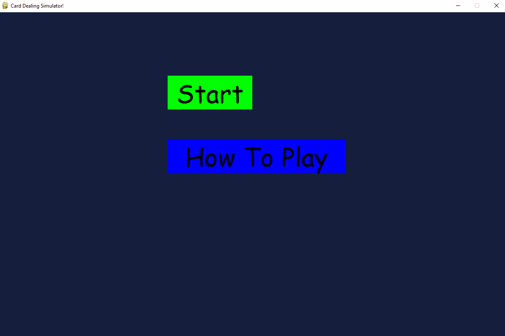

# card_pygame
> note: Readme might not reflect games current state

## How to play Game
```
set PYTHONPATH=%CD%;%CD%\src
```
```
python -m src.main
```
Windows:
```commandline
run run.bat
```
Linux / Mac:
```commandline
run run.sh
```

[//]: # (## Install)

[//]: # (```)

[//]: # (pip install -r requirements.txt)

[//]: # (```)

[//]: # (## Run)

[//]: # (```)

[//]: # ([//]: # python -m src.main)

[//]: # (```)

How to Run

> Note Because project was created using pycharm, some import paths may not be automatically functional without 
```
@echo off
cd /d %~dp0

set PYTHONPATH=%CD%;%CD%\src

python -m src.main

pause
@echo off
cd /d %~dp0
```
set PYTHONPATH=%CD%;%CD%\src

python -m src.main

pause
[//]: # (```)

[//]: # (from src.game.game import Game   # absolute from package root)

[//]: # (from game.game import Game       # absolute from a different assumed root)

[//]: # (from .game_screen import GameScreen  # relative import)

[//]: # (```)

> 
> 
## Pygame image errors
> NOTE: To fix 'libpng warning: iCCP: known incorrect sRGB profile'
> 
Windows: Open image in Paint3D and resave

Or to temp fix
```
import os
os.environ["PYGAME_HIDE_SUPPORT_PROMPT"] = "1"
```

or create a 
```python
from PIL import Image
import os

folder = "your_image_folder"

for filename in os.listdir(folder):
    if filename.endswith(".png"):
        path = os.path.join(folder, filename)
        img = Image.open(path)
        img.save(path)
```

## Controls
- Click "Start" to deal cards
- Click 'How To Play' for non-existent instructions
  - Click "Back" to return to menu


> Image from pre v0.0.2


> Image from pre v0.0.2

---

## 🧪 My Implementation Notes 
<details open>

### Buttons
- Created in main.py
- Drawn only in menu state
- Use is_hovered() for clicks

### State System
- current_state = "menu"
- switches on button click

[//]: # (### Problems I hit)

[//]: # (- &#40;write bugs here&#41;)

[//]: # (- &#40;what fixed them&#41;)

### Improvements for later
- Better UI layout
- Animations
- Sound
- Gameplay balancing
- .exe via:
```
pyinstaller --onefile --windowed main.py
```
</details>

## Folder Structure 
> Last updated pre v0.0.5

note: (__init__.py files not accounted for)

```
project/
│
├── src/          ← code, monster images also inside here for now
├── script/       ← dev scripts (relocatable run.bat etc)
│
│
├── README.md
├── requirements.txt
├── run.bat       <- Windows script to run game (root-based script)
├── run.sh        <- Linux script to run game (root-based script) (untested)
```
# Dev scripts (Run game via these)
``` 
    scripts/
    │
    ├── run.bat
    │
    ├── run.sh (untested)
```
## Code Structure
```
src/
├── main.py             # Entry point of the game
│
├── battle/
│   ├── __init__.py
│   ├── game.py          # Core battle loop / logic
│   ├── monster.py       # Monster definitions & behavior
│   ├── player.py        # Player logic & stats
│   ├── shop.py          # Shop system
│   ├── spell.py         # Spell classes & definitions
│   ├── state.py         # Battle state management
│
├── sound/
│   ├── music.py         # Background music handling
│   ├── sfx.py           # Sound effects
│
├── ui/
│   ├── components/
│   │   ├── __init__.py
│   │   ├── battle_log.py   # Displays combat text/log
│   │   ├── card_view.py    # Card rendering logic
│   │   ├── spell_menu.py   # Spell selection UI
│   │
│   ├── screens/
│   │   ├── battle_screen.py   # Main battle screen
│   │   ├── how_to_screen.py   # Instructions/tutorial screen
│   │   ├── menu_screen.py     # Main menu screen
│   │
│   ├── theme/
│   │   ├── __init__.py
│   │   ├── button.py      # Button UI elements
│   │   ├── cursor.py      # Cursor styling/logic
│   │   ├── panel.py       # UI panels/containers
│   │   ├── theme.py       # Colors, fonts, styling config
│
├── utils/
│   ├── __init__.py
│   ├── config.py       # Global configuration/settings
│

```

<details>
<summary>Future Project Structure (If project got bigger)</summary>

```
src/
├── main.py
│
├── core/
│   ├── battle/
│   │   ├── battle.py
│   │   ├── state.py
│   │   ├── actions.py
│   │   ├── rules.py
│   │   └── turn_resolution.py
│   ├── entities/
│   │   ├── monster.py
│   │   ├── player.py
│   │   └── spell.py
│   └── progression/
│       ├── wave_manager.py
│       └── shop_logic.py
│
├── app/
│   ├── game.py
│   ├── game_state.py
│   └── screen_router.py
│
├── ui/
│   ├── screens/
│   │   ├── menu_screen.py
│   │   ├── battle_screen.py
│   │   ├── how_to_screen.py
│   │   └── shop_screen.py
│   ├── renderers/
│   │   ├── battle_renderer.py
│   │   ├── card_renderer.py
│   │   ├── hud_renderer.py
│   │   └── background_renderer.py
│   ├── components/
│   │   ├── battle_log.py
│   │   ├── spell_menu.py
│   │   └── button.py
│   └── theme/
│       ├── theme.py
│       ├── panel.py
│       └── cursor.py
│
├── assets/
│   ├── image_cache.py
│   ├── sound_manager.py
│   └── font_manager.py
│
└── utils/
    └── config.py
```
</details>