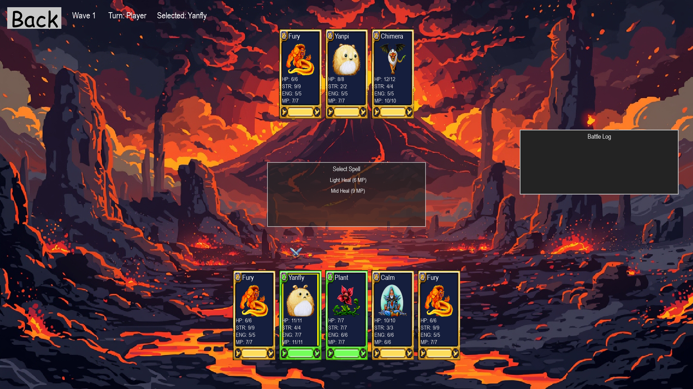
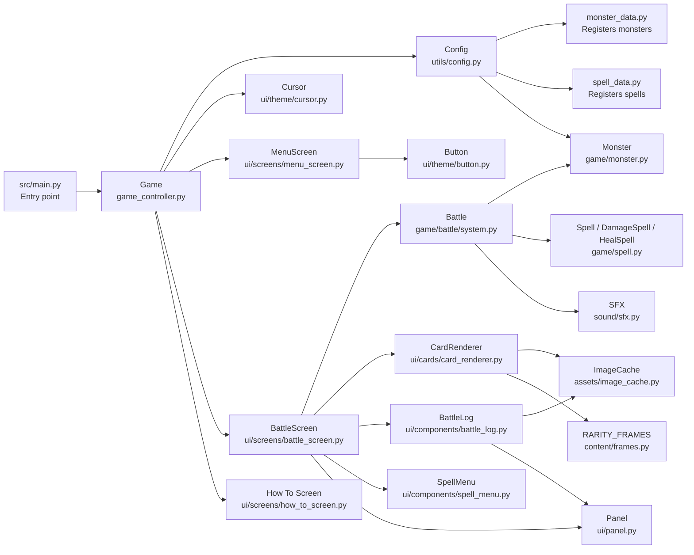

# card_pygame



## Requirements / dependencies

To run project, the follow  is required: 
- Python 3.13 recommend
- Pygame

Install dependencies with:
```bash
pip install -r requirements.txt
```

## How to Run
Game must be ran from project root directory:

### Windows

Run:

```bash
run.bat
```

or manually:
```bash
pip install -r requirements.txt
python -m src.main
```

## How to Play

Wave Mode
- Player starts with 5 cards, dealt at random, including chances to get rare cards.
- Enemy starts with 3 cards.
- Select one of your cards from the bottom to attack
- use either:
    - Either regular attack with by then click an enemy attack 
    - or select a spell before attacking to deal magic damage
- AI enemy will then take its turn.
- Winner eliminates all opposing players cards.
- Winning rounds will reward an additional card and increase the wave count.

## Controls
- Mouse click: select cards / buttons
- Start button: Starts the game
- How to playL opens instructions
- Back button: returns to menu


## File Structure
<details open>
<summary>Click to collapse</summary>

```text
src/
├── main.py
│
├── game/
│   ├── game_controller.py
│   ├── game_state.py
│   ├── monster.py
│   ├── player.py
│   ├── spell.py
│   └── battle/
│       └── system.py
│
├── ui/
│   ├── components/
│   │   ├── battle_log.py
│   │   ├── card_view.py
│   │   └── spell_menu.py
│   ├── screens/
│   │   ├── battle_screen.py
│   │   ├── how_to_screen.py
│   │   └── menu_screen.py
│   └── theme/
│       ├── button.py
│       ├── cursor.py
│       ├── panel.py
│       └── theme.py
│
├── sound/
│   ├── music.py
│   └── sfx.py
│
└── utils/
    └── config.py
```
</details>

## File Purposes

| File | Purpose                                                                                                  |
|---|----------------------------------------------------------------------------------------------------------|
| `src/main.py` | Entry point. Loads config, creates the game object, and starts the game.                                 |
| `src/game/game_controller.py` | Main game controller. Handles screen switching and the overall game loop.                                |
| `src/ui/screens/battle_screen.py` | Main battle screen. Handles player clicks, drawing the battle UI, spell menu, and battle result display. |
| `src/game/battle/system.py` | Core battle rules. Handles turns, attacks, spell use, round resolution, and battle winner logic.         |
| `src/game/monster.py` | Defines the card/monster objects used in battle.                                                         |
| `src/game/spell.py` | Defines spell behaviour such as damage and healing.                                                      |
| `src/utils/config.py` | Loads game data, assets, players, enemies, cards, and backgrounds.                                       |


## Code Structure


## Test Cases
| Test area                                     | Problem found                                                                                              | Fix made | Result                                                                  |
|-----------------------------------------------|------------------------------------------------------------------------------------------------------------|---|-------------------------------------------------------------------------|
| Winner / loser screen                         | Winner / loser values could be set incorrectly causing the wrong battle result.                            | Fixed `self.winner` and `self.loser` values in battle result logic. | The correct winner is now displayed.                                    |
| You Win screen not transisioning to next wave | After winninga a battle the gamame did not correctly start the next wave.                                  | Changed the  so `start_new_wave()` returns to gameplay instead of immediately returning to the menu. | Winning now starts the next wave correctly.                             |
| Result title display                          | Python treated `0` as false, so `self.battle.winner or 0` causing a player win to display the wrong title. | Replaced the expression with explicit checks for `None`, `0`, and `1`. | The result screen now correctly shows `Draw`, `You Win`, or `You Lose`. |
| Monster spawning in new waves                 | New waves did not always spawn monsters consitantly.                                                       | Added monster pool to the `Monster` class  available monsters can be stored and retrieved when generating new waves. | New waves now generate monsters from the available monster pool.        |


## Test Case: You Win screen doesn't start next round

`ui/screens/battle_screen.py`

Issue: 
```python
# Inside handle_mouse_click(..)
if self.battle.state == BattleState.BATTLE_OVER:
    if self.battle.winner == 0:
        self.start_new_wave()
    else:
        self.reset_battle()
    return 'menu'
```
Fix:
```python
# Inside handle_mouse_click(..)
if self.battle.state == BattleState.BATTLE_OVER:
    if self.battle.winner == 0:
        self.start_new_wave()
        return None
    else:
        self.reset_battle()
        return 'menu'
```