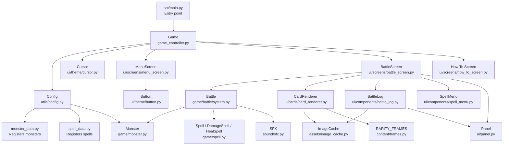
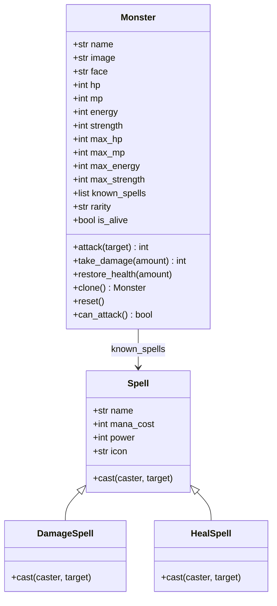
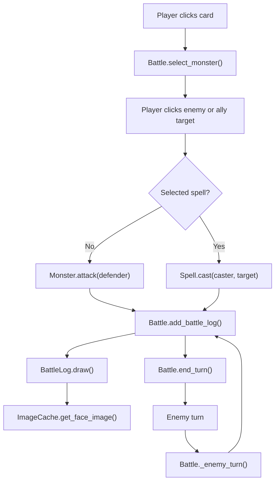
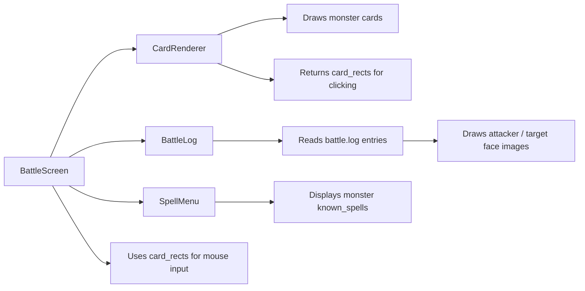

## Project Structure Diagram

```mermaid
flowchart TD
    main["src/main.py<br/>Entry point"] --> game["Game<br/>game_controller.py"]

    game --> config["Config<br/>utils/config.py"]
    game --> cursor["Cursor<br/>ui/theme/cursor.py"]
    game --> menu["MenuScreen<br/>ui/screens/menu_screen.py"]
    game --> battleScreen["BattleScreen<br/>ui/screens/battle_screen.py"]
    game --> howTo["How To Screen<br/>ui/screens/how_to_screen.py"]

    config --> monsterData["monster_data.py<br/>Registers monsters"]
    config --> spellData["spell_data.py<br/>Registers spells"]
    config --> monster["Monster<br/>game/monster.py"]

    battleScreen --> battle["Battle<br/>game/battle/system.py"]
    battleScreen --> cardRenderer["CardRenderer<br/>ui/cards/card_renderer.py"]
    battleScreen --> battleLog["BattleLog<br/>ui/components/battle_log.py"]
    battleScreen --> spellMenu["SpellMenu<br/>ui/components/spell_menu.py"]

    battle --> monster
    battle --> spell["Spell / DamageSpell / HealSpell<br/>game/spell.py"]
    battle --> sfx["SFX<br/>sound/sfx.py"]

    cardRenderer --> imageCache["ImageCache<br/>assets/image_cache.py"]
    battleLog --> imageCache
    cardRenderer --> frames["RARITY_FRAMES<br/>content/frames.py"]

    menu --> button["Button<br/>ui/theme/button.py"]
    battleScreen --> panel["Panel<br/>ui/panel.py"]
    battleLog --> panel
```

## Monster Object Structure

```mermaid
classDiagram
    class Monster {
        +str name
        +str image
        +str face
        +int hp
        +int mp
        +int energy
        +int strength
        +int max_hp
        +int max_mp
        +int max_energy
        +int max_strength
        +list known_spells
        +str rarity
        +bool is_alive
        +attack(target) int
        +take_damage(amount) int
        +restore_health(amount)
        +clone() Monster
        +reset()
        +can_attack() bool
    }

    class Spell {
        +str name
        +int mana_cost
        +int power
        +str icon
        +cast(caster, target)
    }

    class DamageSpell {
        +cast(caster, target)
    }

    class HealSpell {
        +cast(caster, target)
    }

    Monster --> Spell : known_spells
    Spell <|-- DamageSpell
    Spell <|-- HealSpell
```

## Battle Flow

```mermaid
flowchart TD
    start["Player clicks card"] --> select["Battle.select_monster()"]
    select --> target["Player clicks enemy or ally target"]
    target --> attack{"Selected spell?"}

    attack -- No --> physical["Monster.attack(defender)"]
    attack -- Yes --> spell["Spell.cast(caster, target)"]

    physical --> log["Battle.add_battle_log()"]
    spell --> log

    log --> drawLog["BattleLog.draw()"]
    drawLog --> faces["ImageCache.get_face_image()"]

    log --> endTurn["Battle.end_turn()"]
    endTurn --> enemy["Enemy turn"]
    enemy --> ai["Battle._enemy_turn()"]
    ai --> log
```

## Renderer / UI Relationship

```mermaid
flowchart LR
    battleScreen["BattleScreen"] --> renderer["CardRenderer"]
    battleScreen --> log["BattleLog"]
    battleScreen --> spellMenu["SpellMenu"]

    renderer --> cards["Draws monster cards"]
    renderer --> rects["Returns card_rects for clicking"]

    battleScreen --> clicks["Uses card_rects for mouse input"]

    log --> entries["Reads battle.log entries"]
    entries --> faces["Draws attacker / target face images"]

    spellMenu --> spells["Displays monster known_spells"]
```